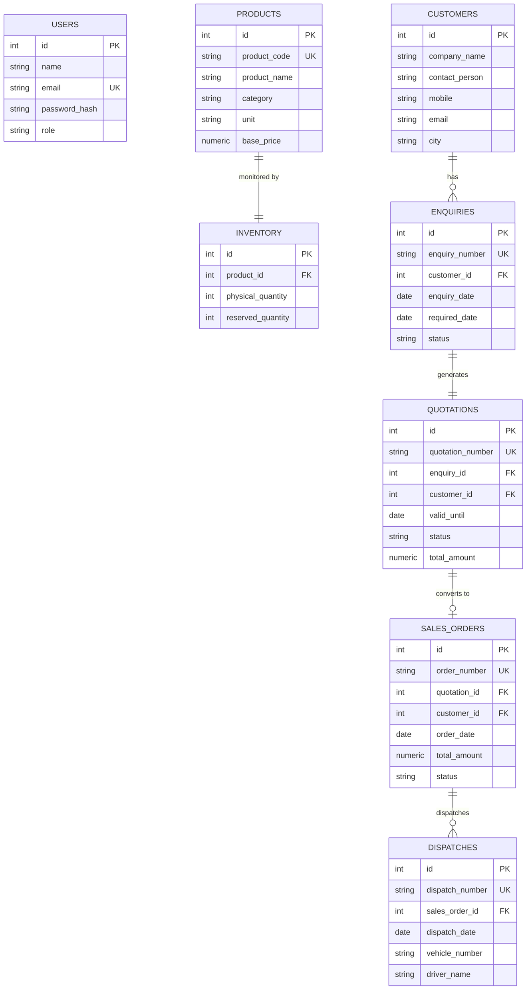

# Industrial ERP Management System (PERN Stack)

A complete **PERN Full-Stack Industrial ERP Application** implementing the full lifecycle:
**Customer Enquiry → Quotation → Sales Order → Stock Reservation → Dispatch**.

Built with **PostgreSQL**, **Express.js**, **React.js**, and **Node.js**.

---

## 🚀 Key Features & Business Logic

- **Role-Based Access Control (RBAC)**:
  - **Sales User**: Create customers, create/view enquiries, generate quotations, update quotation status, convert accepted quotations to Sales Orders.
  - **Admin User**: View enquiries & orders, **Confirm Orders & Reserve Stock** (uses PostgreSQL transaction with `FOR UPDATE` row-level locks), **Dispatch Orders** (atomically updates physical & reserved inventory).
- **Server-Side Financial Calculations**: Quotation line amounts, discounts, and 18% GST are calculated and validated strictly on the backend to prevent client tampering.
- **Atomic Stock Reservation**: Order confirmation reserves stock (`reserved_quantity += qty`) without reducing physical stock (`physical_quantity`). Prevents over-reservation beyond net available stock (`physical - reserved`).
- **Atomic Dispatching**: Dispatching an order reduces both `physical_quantity` and `reserved_quantity` atomically within a single database transaction.

---

## 🔑 Login Credentials

| Role | Email | Password | Allowed Operations |
| :--- | :--- | :--- | :--- |
| **Sales User** | `sales@erp.com` | `sales123` | Customers, Enquiries, Quotations, Convert to Order |
| **Admin User** | `admin@erp.com` | `admin123` | View All, Confirm Order & Reserve Stock, Dispatch Order |

*Quick 1-click login buttons are available on the Login screen for rapid evaluation.*

---

## 🛠️ Project Setup & Installation

### Prerequisites
- Node.js (v18+)
- npm (v9+)

### 1. Install Dependencies
```bash
# Root directory
npm run install:all
```
*Or navigate to `/backend` and `/frontend` separately and run `npm install`.*

### 2. Run Automated Tests
```bash
cd backend
npm test
```
*Executes all 6 mandatory technical case study tests using Jest & Supertest.*

### 3. Start Backend & Frontend Servers

**Backend API Server (Port 5000):**
```bash
cd backend
npm start
```

**Frontend React Server (Port 3000):**
```bash
cd frontend
npm run dev
```

Open [http://localhost:3000](http://localhost:3000) in your browser.

---

## 📊 Database Schema (12 Tables)



---

## 🧪 Automated Test Coverage (`/backend/tests/erp.test.js`)

1. **Quotation Total Calculation**: Validates backend calculation of line item discounts & 18% GST.
2. **Order Conversion Guards**: Asserts `DRAFT` and `REJECTED` quotations fail conversion with HTTP 400.
3. **Duplicate Order Prevention**: Asserts converting an already-converted quotation fails due to `UNIQUE(quotation_id)`.
4. **RBAC Security Enforcement**: Asserts Sales users receive HTTP 403 Forbidden on Admin endpoints.
5. **Inventory Reservation Limit**: Verifies stock reservation fails and rolls back when requested stock exceeds available stock (`physical - reserved`).
6. **Atomic Order Dispatch**: Verifies dispatching an order reduces both physical and reserved quantities correctly and blocks duplicate dispatches.

---

## 💡 Interview Questions & Answers

### Q1: Why use a transaction for inventory reservation?
**Answer:** Stock reservation modifies multiple dependent records (reading inventory availability, updating `reserved_quantity`, and changing order status to `CONFIRMED`). Using a PostgreSQL transaction with row-level locking (`SELECT ... FOR UPDATE`) guarantees atomicity, preventing race conditions when two concurrent requests try to reserve the same stock simultaneously.

### Q2: Why calculate quotation totals on the backend?
**Answer:** The frontend is untrusted input. Calculating unit prices, discount percentages, GST rates, and line totals on the backend prevents users from modifying payload totals via API interception or browser developer tools.
